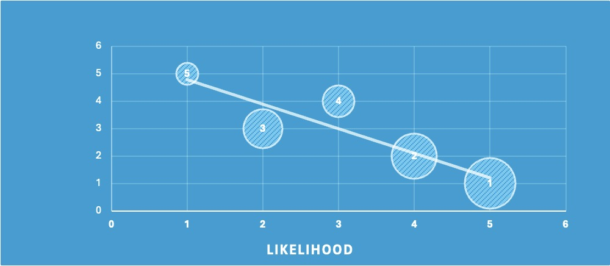

# SuperlifeStyle

## A Health Incentive Program for Superlife Life Insurance

Authors: H. Dharmadasa, E. Gao, K. Kirubakaran, V. Narayan & N. Verghese

<p float="left">
  
  
</p>

SuperLifeStyle is a health incentives program that we at Apex Analytics have designed for SuperLife to implement alongside their long-term life insurance products. The program allows policyholders of these products to earn premiums by engaging with four health initiatives, which we have selected by analyzing and validating SuperLife’s internal research.

## File Tree:

```
.
├── Case Study Documents
│   ├── 2024-srcsc-questions-answers.pdf
│   ├── srcsc-2024-case-study.pdf
│   ├── srcsc-2024-lumaria-encyclopedia-entry.pdf
│   ├── srcsc-2024-official-rules.pdf
│   └── srcsc-2024-superlife-inforce-dataset-key.pdf
├── Data
│   ├── Case Study Data
│   │   ├── 2024-srcsc-superlife-inforce-dataset.csv
│   │   ├── srcsc-2024-interventions.xlsx
│   │   ├── srcsc-2024-lumaria-economic-data.xlsx
│   │   └── srcsc-2024-lumaria-mortality-table.xlsx
│   ├── External Data
│   │   └── superlife_inforce_causes_of_death.csv
│   └── Processed Data
│       ├── Benefit_Modelling.csv
│       ├── Benefits_by_Age_Group.csv
│       ├── CLEANED_2024-srcsc-superlife-inforce-dataset.csv
│       ├── Neoplasm_Mortality_Loading.csv
│       ├── Sensitivity_Analysis.csv
│       ├── Superlife-inforce-mortality-table.csv
│       └── average_mortality_table.xlsx
├── Logos and Figures
│   ├── Benefit_Modelling_page-0001.jpg
│   ├── Benefit_Modelling_page-0002.jpg
│   ├── Benefit_Modelling_page-0003.jpg
│   ├── Benefits by Age Group_page-0001.jpg
│   ├── Cost reduction.png
│   ├── Lives saved.png
│   ├── Objectives.png
│   ├── Pipeline.png
│   ├── Post Interventions Life Table_page-0001.jpg
│   ├── Risk Map.jpeg
│   ├── Risk Rate.jpeg
│   ├── soa.png
│   ├── SPWL Sens Analysis.png
│   ├── T20 Sens Analysis.png
│   ├── unsw_horizontal.png
│   └── unsw_vertical.png
├── R Code
│   ├── ACTL5100 Lumaria Mortality Modelling.R
│   ├── Inforce Benefit Modelling.Rmd
│   ├── Inforce Data Cleaning.Rmd
│   ├── Inforce Data Visualisation.Rmd
│   ├── Inforce Mortality Modelling.Rmd
│   └── Sensitivity Analysis.Rmd
├── .gitignore
├── Apex Analytics Report.pdf
└── README.md
```

### Target Objectives for SuperLife:


* <u>Incentivize Healthy Behaviors Through Participation in the Program  </u>
  
  Participation in SuperLifeStyle involves engaging in healthy behaviors, and policyholders will be encouraged to participate through discounts to their premiums. Advertising the health benefits of participation will also encourage participation.  

* <u>Decrease Expected Mortality </u>
  
  SuperLife has provided us with data indicating the health incentives which we have incorporated into SuperLifeStyle will decrease expected mortality for those who engage with them, and we have done our own external research to validate these numbers. Thus, the implementation of this program will lead to the decrease in expected mortality for participating policyholders.  

* <u>Increase Life Insurance Sales</u> 
  
  The discounts offered by SuperLifeStyle will aim to increase sales by attracting customers to SuperLife’s long-term insurance products; Lumarians who may not have considered purchasing these products before due to the price will now be able to access them at a price they would accept in exchange for participation.  

* <u>Improve Product Marketability and Competitiveness  </u>
  
  Similarly to the previous objective, the discounts offered by SuperLifeStyle will lower the effective price of long-term insurance for those willing to participate in the program, which will improve the marketability and competitiveness. 

* <u>Add Economic Value to Superlife</u>
  
    The reduction in mortality for participating policyholders will reduce their expected mortality and thus reduce the expected claims costs of these insurance products. The discounts offered by the scheme can be in the form of reduced premiums properly repriced in the hopes of increasing sales volume, or Superlife can choose not to reprice premiums and hold on to additional cost savings themselves. SuperLifeStyle will provide economic value through the increase in insurance sales and competitiveness of SuperLife’s products, as well as providing unique value in the form of health interventions that will separate Superlife from its competitors.

### Project Development Pipeline:


We have determined that the reduction in claims costs from SuperLifeStyle’s mortality benefits will offset the implementation costs for term insurance between the ages of 23 and 84, and whole-life insurance for all ages above 23. This reduction in expenses will fund the premium discounts. The reduced costs and higher expected insurance sales from the discounts will create larger profits for SuperLife. 

The graph below indicates the lives that would have been saved if the program was implemented 20 years ago; the claims cost savings would have been Č11,491,341,272.57 for term insurance policies and Č58,051,148,810.82 for whole-life policies. The savings would increase to Č14,409,136,415.29 and Č131,818,490,081.97 after another 20 years. 


Our analysis was limited by the data and assumptions we used as inputs. We primarily relied on data provided by SuperLife, such as the life table and mortality reduction figures; we have validated this data through reasonability checks and external research. To address the risk of inappropriately selected assumptions, we performed sensitivity testing which provided confidence that reasonable deviations in our assumptions would not significantly impact our findings. 

Alongside the sensitivity analysis, we have also considered several qualitative risks such as policyholders attempting to exploit the program without properly engaging. Mitigation strategies were listed in order to ensure the implementation of SuperLifeStyle comes with minimal risk.  

### Program Design


* **<u>Safety Campaigns</u>**
  
  Safety campaigns play a pivotal role in SuperLifeStyle, offering educational opportunities to policyholders on a variety of safety topics. These campaigns are designed to empower individuals with awareness, encouraging them to make more informed decisions. From fire safety and home security to road safety and health awareness, safety campaigns cover a broad spectrum of topics aimed at minimizing risks and protecting lives. SuperLife allocates approximately ˇC10 - ˇC35 per participant towards content development, including educational materials, infographics, videos, online modules, and in-person demonstrations. These resources are disseminated through various channels such as emails, social media, and websites, incentivizing participation with discounts to premiums.

* **<u>Community Fitness Challenges</u>**
  
  SuperLife’s SuperLifeStyle scheme can provide incentives such as premium discounts, gift cards, or other rewards to stimulate engagement in fitness challenges. Beyond mere motivation for individual health priorities, SuperLife can integrate community fitness challenges with its term and life assurance offerings. This strategic bundling not only aims to reduce mortality rates but also to enhance sales, revenue, foster brand loyalty and engagement, and help SuperLife balance expenses and mortality reduction.

* **<u>Preventive Screening</u>**
  
  SuperLife can offer rewards to policyholders that undergo preventive screening programs, specifically those focused on cancers. Rewards include covering an annual screening session (ˇC32.5), and a reduction in yearly premiums for those that engage with the intervention (ˇC32.5). As most cancer related deaths occur beyond the age of 50, SuperLife can offer this intervention to policyholders above this age. Research supported mortality reduction figures roughly in-line with SuperLife’s own findings.

* **<u>Smoking Cessations</u>**
  
  This incentive encourages the quitting of smoking. Participants will be directed to facilities and services known to help with the cessation of smoking, such as individual and group counselling sessions, and nicotine replacement therapy. Successfully abstaining from smoking is required for the policyholder to be considered as engaging with this incentive.
  
  While short-term participation in these initiatives is enough to begin accessing the discounts, the impact to mortality from engagement will only become apparent over a much longer period, thus consistent long-term participation is a key requirement of the program. Participants who cease to engage will no longer receive discounts and may be required to pay back a portion of the premiums previously discounted.
  
  The selection process of these four incentives was as follows: we set up a model to rank the extensive list of incentives provided to us by SuperLife’s product development team based off the impact to mortality balanced by the cost of implementation and identified Safety Campaigns and Community Fitness Challenges as the two most effective. We then selected two more incentives that also ranked highly that addressed specific health concerns that we noticed had a large impact on SuperLife’s policyholder demographic; cancer is a leading cause of death for policyholders and thus Preventative Screening was selected, and a large portion of policyholders are smokers, so Smoking Cessation Programs was selected.
  
  These incentives were selected through external research, we were able to find details on how these health initiatives worked which aided in the construction of SuperLifeStyle’s logistics. We were also able to broadly validate the mortality impact and cost figures provided by SuperLife; this will be discussed further in the Data and Data Limitations section of the report. All sources are listed in the bibliography.

### Risk and Risk Mitigation Considerations




The implementation of SuperLifeStyle is accompanied by several key risks which this section will outline and discuss mitigation strategies for. 

* <u>*Climate*</u> – High Severity, Moderate Likelihood – Can lead to higher mortality rate due to heat related illnesses. 

* <u>*Inflation*</u> – Moderate Severity, High Likelihood – Persistently high inflation can curb spending as cost-of-living pressures will force potential customers to spend elsewhere which will affect SuperLifeStyle program performance and profits. 

* *<u>Pandemic</u>* – High Severity, Low Likelihood – Can exponentially increase mortality rate and cause a downturn in the economy leading to an adverse impact on the program and profits 

* *<u>Engagement Rate</u>* – Low Severity, High Likelihood – Low impact on results when inflation rates are fixed 

* <u>*War*</u> – High Severity, low Likelihood – Creates market volatility and potential increase in mortality rate amongst annuitants. Impacts economy adversely and leads to poor investment returns and profits 

#### Sensitivity Analysis

<p float="left">
  
  
</p>

A key quantitative risk is the incorrectness of assumptions used. To address this risk, we have conducted sensitivity testing to identify the severity of the consequences should this occur.