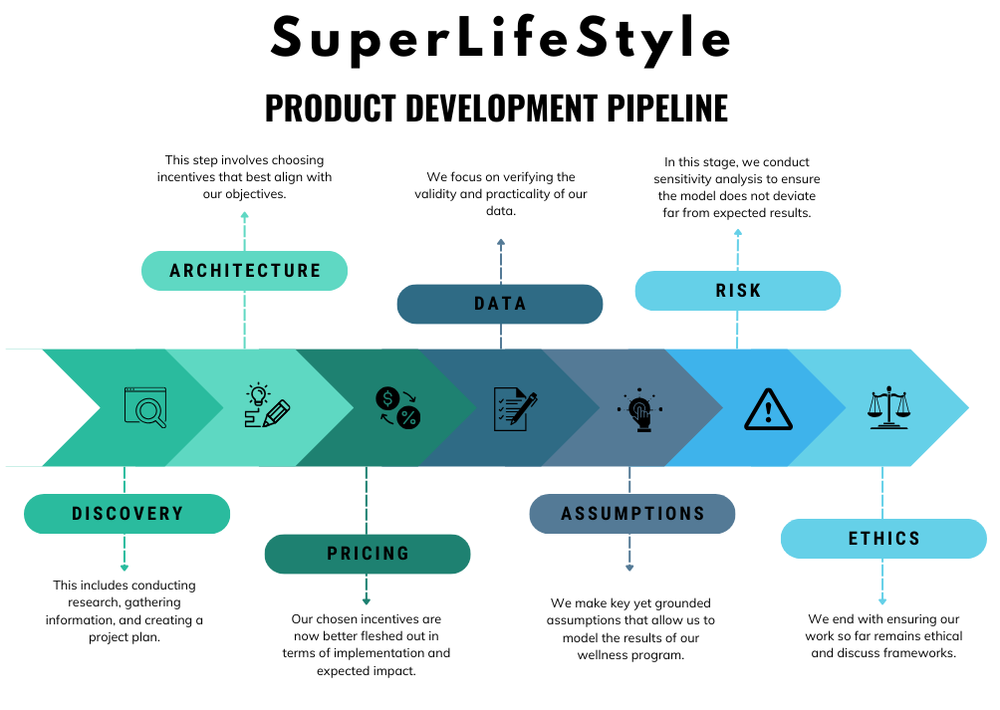
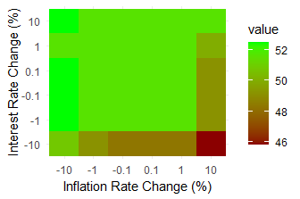

# SuperlifeStyle
## A Health Incentive Program for Superlife Life Insurance 
Authors: H. Dharmadasa, E. Gao, K. Kirubakaran, V. Narayan & N. Verghese


SuperLifeStyle is a health incentives program that we at Apex Analytics have designed for SuperLife to implement alongside their long-term life insurance products. The program allows policyholders of these products to earn premiums by engaging with four health initiatives, which we have selected by analyzing and validating SuperLife’s internal research.

## File Tree:

```
.
├── Case Study Documents
│   ├── 2024-srcsc-questions-answers.pdf
│   ├── srcsc-2024-case-study.pdf
│   ├── srcsc-2024-lumaria-encyclopedia-entry.pdf
│   ├── srcsc-2024-official-rules.pdf
│   └── srcsc-2024-superlife-inforce-dataset-key.pdf
├── Data
│   ├── Case Study Data
│   │   ├── 2024-srcsc-superlife-inforce-dataset.csv
│   │   ├── srcsc-2024-interventions.xlsx
│   │   ├── srcsc-2024-lumaria-economic-data.xlsx
│   │   └── srcsc-2024-lumaria-mortality-table.xlsx
│   ├── External Data
│   │   └── superlife_inforce_causes_of_death.csv
│   └── Processed Data
│       ├── Benefit_Modelling.csv
│       ├── Benefits_by_Age_Group.csv
│       ├── CLEANED_2024-srcsc-superlife-inforce-dataset.csv
│       ├── Neoplasm_Mortality_Loading.csv
│       ├── Sensitivity_Analysis.csv
│       ├── Superlife-inforce-mortality-table.csv
│       └── average_mortality_table.xlsx
├── Logos and Figures
│   ├── Benefit_Modelling_page-0001.jpg
│   ├── Benefit_Modelling_page-0002.jpg
│   ├── Benefit_Modelling_page-0003.jpg
│   ├── Benefits by Age Group_page-0001.jpg
│   ├── Cost reduction.png
│   ├── Lives saved.png
│   ├── Objectives.png
│   ├── Pipeline.png
│   ├── Post Interventions Life Table_page-0001.jpg
│   ├── Risk Map.jpeg
│   ├── Risk Rate.jpeg
│   ├── soa.png
│   ├── SPWL Sens Analysis.png
│   ├── T20 Sens Analysis.png
│   ├── unsw_horizontal.png
│   └── unsw_vertical.png
├── R Code
│   ├── ACTL5100 Lumaria Mortality Modelling.R
│   ├── Inforce Benefit Modelling.Rmd
│   ├── Inforce Data Cleaning.Rmd
│   ├── Inforce Data Visualisation.Rmd
│   ├── Inforce Mortality Modelling.Rmd
│   └── Sensitivity Analysis.Rmd
├── .gitignore
├── Apex Analytics Report.pdf
└── README.md
```
##### Target Objectives for SuperLife: 


* Incentivize Healthy Behaviors Through Participation in the Program  

 Participation in SuperLifeStyle involves engaging in healthy behaviors, and policyholders will be encouraged to participate through discounts to their premiums. Advertising the health benefits of participation will also encourage participation.  

* Decrease Expected Mortality 

 SuperLife has provided us with data indicating the health incentives which we have incorporated into SuperLifeStyle will decrease expected mortality for those who engage with them, and we have done our own external research to validate these numbers. Thus, the implementation of this program will lead to the decrease in expected mortality for participating policyholders.  

* Increase Life Insurance Sales 

 The discounts offered by SuperLifeStyle will aim to increase sales by attracting customers to SuperLife’s long-term insurance products; Lumarians who may not have considered purchasing these products before due to the price will now be able to access them at a price they would accept in exchange for participation.  

* Improve Product Marketability and Competitiveness  

 Similarly to the previous objective, the discounts offered by SuperLifeStyle will lower the effective price of long-term insurance for those willing to participate in the program, which will improve the marketability and competitiveness. 

* Add Economic Value to Superlife  

The reduction in mortality for participating policyholders will reduce their expected mortality and thus reduce the expected claims costs of these insurance products. The discounts offered by the scheme can be in the form of reduced premiums properly repriced in the hopes of increasing sales volume, or Superlife can choose not to reprice premiums and hold on to additional cost savings themselves. SuperLifeStyle will provide economic value through the increase in insurance sales and competitiveness of SuperLife’s products, as well as providing unique value in the form of health interventions that will separate Superlife from its competitors.

##### Project Development Pipeline:



We have determined that the reduction in claims costs from SuperLifeStyle’s mortality benefits will offset the implementation costs for term insurance between the ages of 23 and 84, and whole-life insurance for all ages above 23. This reduction in expenses will fund the premium discounts. The reduced costs and higher expected insurance sales from the discounts will create larger profits for SuperLife. 

The graph below indicates the lives that would have been saved if the program was implemented 20 years ago; the claims cost savings would have been Č11,491,341,272.57 for term insurance policies and Č58,051,148,810.82 for whole-life policies. The savings would increase to Č14,409,136,415.29 and Č131,818,490,081.97 after another 20 years. 


Our analysis was limited by the data and assumptions we used as inputs. We primarily relied on data provided by SuperLife, such as the life table and mortality reduction figures; we have validated this data through reasonability checks and external research. To address the risk of inappropriately selected assumptions, we performed sensitivity testing which provided confidence that reasonable deviations in our assumptions would not significantly impact our findings. 

Alongside the sensitivity analysis, we have also considered several qualitative risks such as policyholders attempting to exploit the program without properly engaging. Mitigation strategies were listed in order to ensure the implementation of SuperLifeStyle comes with minimal risk.  

#### Risk and Risk Mitigation Considerations  

The implementation of SuperLifeStyle is accompanied by several key risks which this section will outline and discuss mitigation strategies for. 

* Climate – High Severity, Moderate Likelihood – Can lead to higher mortality rate due to heat related illnesses. 

* Inflation – Moderate Severity, High Likelihood – Persistently high inflation can curb spending as cost-of-living pressures will force potential customers to spend elsewhere which will affect SuperLifeStyle program performance and profits. 

* Pandemic – High Severity, Low Likelihood – Can exponentially increase mortality rate and cause a downturn in the economy leading to an adverse impact on the program and profits 

* Engagement Rate – Low Severity, High Likelihood – Low impact on results when inflation rates are fixed 

* War – High Severity, low Likelihood – Creates market volatility and potential increase in mortality rate amongst annuitants. Impacts economy adversely and leads to poor investment returns and profits 


#### Sensitivity Analysis


